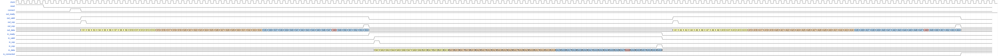
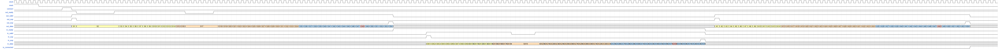
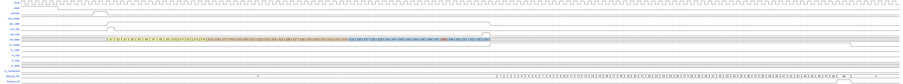
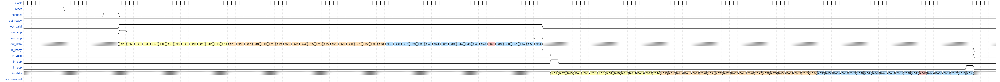
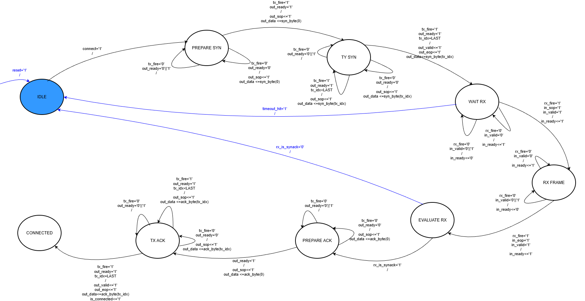
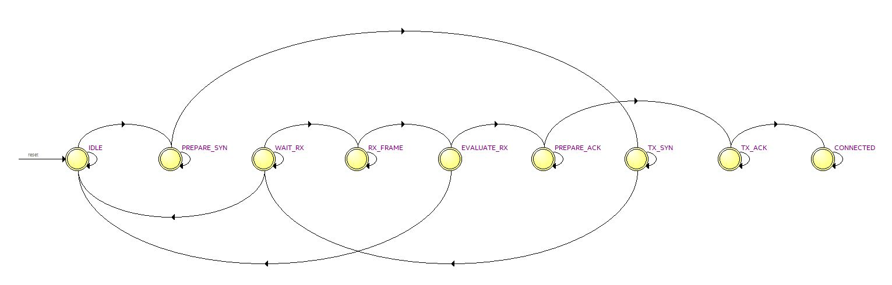
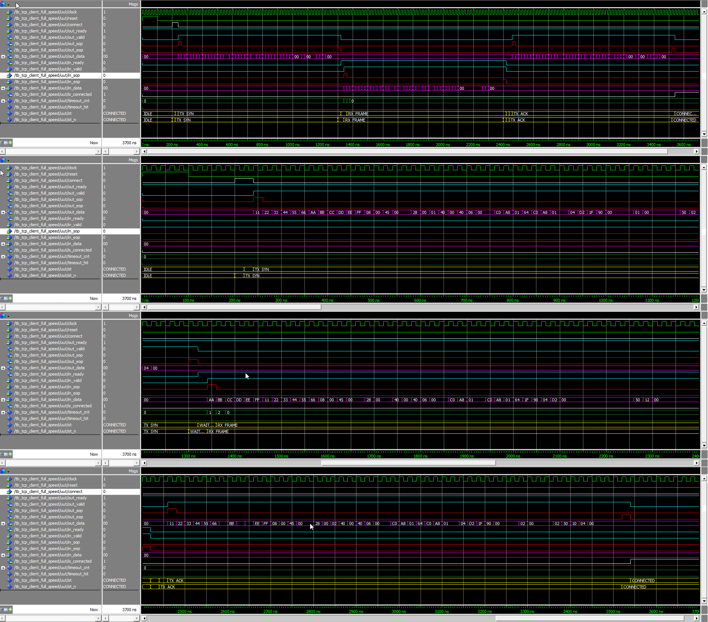

# tcp-client-handshake
VHDL modul koji implementira klijentsku stranu uspostavljanja TCP konekcije.  

## Uvod
Transportni sloj pruža logičku komunikaciju između aplikacijskih procesa na različitim hostovima. Logička komunikacija podrazumijeva slanje poruka između hostova kao da su direktno povezani, bez brige o stvarnoj fizičkoj infrastukturi koja leži ispod. Pakete na transportnom sloju nazivamo segmentima. Protokoli na transportnom sloju su implementirani na krajnjim tačakama a ne na mrežnim ruterima. Jedan od tih protokola je TCP (Transmission Control Protocol). 
## TCP protokol i scenariji razmjene poruka
TCP protokol pruža pouzdanu, konekcijski orijentisanu komunikaciju između krajnjih korisnika. TCP koristi kontrolu toka, sekvencijske brojeve, tajmere, potvrde te na taj način osigurava da poruke koje su poslane budu ispravne i tačno po redoslijedu slanja primljene [1].

### Three-way handshake
Uspostava TCP konekcije realizuje se putem three-way handshake mehanizma, koji osigurava da su i klijent i server spremni za pouzdanu komunikaciju. Proces se sastoji od tri koraka: slanja SYN poruke od klijenta ka serveru, zatim odgovora servera sa SYN+ACK porukom, te završne ACK poruke od strane klijenta prikazane pomoću sekvencijalnog dijagrama na Slici 1 [1].

 

Slika 1: TCP three-way handshake (klijentska strana)

U okviru ovog projekta implementirana je klijentska strana TCP three-way handshake procesa, pri čemu se serverska strana posmatra kao eksterni entitet. Prilikom uspostave konekcije prenose se Ethernet okviri u kojima je enkapsuliran IPv4 paket, dok je unutar IPv4 paketa enkapsuliran TCP segment. Na dijagramu su prikazana samo polja Ethernet, IPv4 i TCP zaglavlja koja su relevantna za proces uspostave TCP konekcije, dok se ostala polja ne razmatraju u kontekstu ovog projekta. Sekvencijski i potvrđujući brojevi prikazani na dijagramu služe ilustraciji TCP mehanizma, pri čemu se vrijednosti uvećavaju za 1 zbog prijema SYN segmenta koji zauzima jedan sekvencijski broj.[2] U nastavku dokumenta objašnjen je sadržaj i enkapsulacija prenesenih paketa. 

### Sadržaj i enkapsulacija prenesenih paketa
Prilikom analize razmjene poruka tokom uspostave TCP konekcije, neophodno je posmatrati kompletan Ethernet/IP/TCP paket.

Ethernet zaglavlje sadrži sljedeća polja od interesa: izvorišna i odredišna MAC adresa, kao i polje EtherType koje označava da se u podatkovnom dijelu nalazi IPv4 paket (vrijednost 0x0800).

Slika 2: Struktura Ethernet II okvira

IPv4 zaglavlje sadrži izvorne i odredišne IP adrese, kao i polje Protocol koje ima vrijednost 6 i označava da se u podatkovnom dijelu nalazi TCP segment.

Slika 3: Struktura IPv4 zaglavlja 

TCP segment se sastoji od zaglavlja i podatkovnog dijela. Zaglavlje TCP segmenta sadrži izvorni i odredišni port, sekvencijski broj, potvrđujući broj, veličinu prozora, opcionalna polja, kao i kontrolne flagove koji upravljaju uspostavom i prekidom konekcije. Flagovi SYN i ACK su posebno značajni jer se koriste tokom three-way handshake procesa. U tipičnoj implementaciji TCP protokola, zaglavlje segmenta ima minimalnu dužinu od 20 bajtova, dok se tokom uspostave konekcije ne prenose aplikacioni podaci. [1] 

Slika 4: Struktura TCP segmenta [1]

### Zaglavlja paketa u procesu uspostave TCP konekcije

Tokom uspostave TCP konekcije u okviru three-way handshake procesa prenose se samo kontrolni TCP segmenti. U SYN segmentu aktivan je samo SYN kontrolni flag, dok se potvrđujući broj ne koristi. Server zatim odgovara SYN+ACK segmentom, pri čemu ACK polje sadrži sekvencijski broj klijenta uvećan za jedan. Na kraju, klijent šalje ACK segment sa aktivnim ACK kontrolnim flagom kojim potvrđuje sekvencijski broj servera, čime se konekcija smatra uspješno uspostavljenom.

### Tok uspostave TCP konekcije (klijentska strana)
#### Slučaj 1: Uspješna uspostava konekcije

Slučaj prikazuje standardni three-way handshake proces. Nakon aktivacije signala `connect`, klijent šalje TCP SYN segment prema serveru. Server odgovara SYN+ACK segmentom, nakon čega klijent šalje završni ACK segment. Uspješna uspostava konekcije indicira se postavljanjem signala `is_connected` na logičku vrijednost '1'.

#### Slučaj 2: Izostanak odgovora servera

Nakon slanja TCP SYN segmenta, klijent ne prima odgovarajući SYN+ACK odgovor sa serverske strane. Modul ostaje u stanju čekanja odgovora i ne prelazi u završnu fazu uspostave konekcije, pri čemu signal `is_connected` ostaje na logičkoj vrijednosti '0'. Implementacija ne uključuje mehanizme retransmisije niti vremenskog isteka, te se proces uspostave može prekinuti isključivo resetovanjem ili ponovnim pokretanjem inicijacije konekcije.

#### Slučaj 3: Neočekivan odgovor servera (RST)

U ovom scenariju klijent šalje TCP SYN segment, ali sa serverske strane prima neočekivan odgovor, kao što je TCP segment sa postavljenim RST flag-om ili segment koji ne odgovara očekivanom SYN+ACK odgovoru. Na osnovu primljenog paketa, modul detektuje da uspostava konekcije nije moguća, prekida proces uspostave i vraća se u početno stanje. Signal `is_connected` ostaje na logičkoj vrijednosti '0'.

 

Slika 5: Neočekivan odgovor servera prilikom uspostave TCP konekcije 

U skladu sa TCP specifikacijom, RST segment koji predstavlja odgovor na primljeni SYN segment sadrži i ACK flag, pri čemu potvrđujući broj odgovara sekvencijskom broju primljenog SYN-a uvećanom za jedan. [2]

Navedeni slučajevi predstavljaju osnovu za modeliranje upravljačke logike pomoću FSM dijagrama, kao i za definisanje scenarija, te izradu WaveDrom dijagrama koji grafički prikazuju ponašanje signala kroz vrijeme.

## Opis dizajna modula

Modul `tcp_client` realizuje klijentsku stranu uspostave TCP konekcije. Upravljačka logika je implementirana kao konačni automat (FSM) koji upravlja redoslijedom slanja i prijema TCP segmenata, dok se komunikacija sa okruženjem ostvaruje putem Avalon-ST interfejsa.

Slika 6: Blok dijagram modula tcp_client

## Interfejs i signali
U nastavku su opisani ulazni i izlazni signali modula `tcp_client` koji čine njegov interfejs prema okruženju.

### Ulazni signali

- **clock**  
  Sistemski takt koji sinhronizuje rad modula.

- **reset**  
  Asinhroni ili sinhroni reset signal kojim se modul vraća u početno stanje.

- **connect**  
  Signal kojim se inicira proces uspostave TCP konekcije.

- **server_mac**, **server_ip**, **server_port**  
  Parametri koji definišu MAC adresu, IP adresu i port servera sa kojim se uspostavlja TCP konekcija.

- **client_mac**, **client_ip**, **client_port**  
  Parametri koji definišu MAC adresu, IP adresu i port klijenta.

- **in_data**  
  Ulazni podatkovni signal Avalon-ST interfejsa koji nosi bajtove primljenog TCP segmenta (dolazi sa servera).

- **in_valid**  
  Signal koji označava da su podaci na signalu `in_data` važeći.

- **in_sop**, **in_eop**  
  Signali koji označavaju početak i kraj TCP segmenta.

- **out_ready**  
  Signal kojim strana servera označava spremnost za prihvatanje izlaznih podataka.

### Izlazni signali

- **out_data**  
  Izlazni podatkovni signal Avalon-ST interfejsa koji nosi bajtove TCP segmenta koji se šalje (prema serveru).

- **out_valid**  
  Signal koji označava da su podaci na signalu `out_data` važeći.

- **out_sop**, **out_eop**  
  Signali koji označavaju početak i kraj TCP segmenta na izlazu.

- **in_ready**  
  Signal kojim modul (klijentska strana) označava spremnost za prihvatanje ulaznih podataka.

- **is_connected**  
  Statusni signal koji označava da je TCP konekcija uspješno uspostavljena.

## Ready/Valid rukovanje (Avalon-ST)

Prijenos podataka na Avalon-ST interfejsu realizuje se korištenjem ready/valid rukovanja. Prijenos ili prijem podataka vrši se isključivo u taktovima u kojima su signali `valid` i `ready` istovremeno aktivni, dok se u suprotnom prenos odgađa bez gubitka informacija.

## Simulacija i verifikacija
### Opis testnih scenarija

Verifikacija funkcionalnosti modula `tcp_client` vrši se simulacijom karakterističnih testnih scenarija koji pokrivaju uspostavu TCP konekcije i ponašanje modula u prisustvu ready/valid rukovanja na Avalon-ST interfejsu.

#### Testni scenarij 1: Uspješna uspostava TCP konekcije

Simulira se standardni three-way handshake proces. Nakon aktivacije signala `connect`, modul generiše TCP SYN segment koji se šalje prema serveru. To će značiti da se formira segment sa SYN flag-om postavljenim na 1 te dodatno podešenim ostalim poljima TCP segmenta (kao što su 16-bitni izvorišni i destinacijski port). Taj segment će se slati preko 8-bitnog podatkovnog izlaza (`out_data`). Server odgovara SYN+ACK segmentom (SYN i ACK flag-ovi postavljeni na 1) koji se ispravno prima preko ulaznog Avalon-ST interfejsa (`in_data`, `in_valid`, `in_sop`, `in_eop`). Na osnovu primljenog odgovora, modul šalje završni ACK segment (ACK na 1) i postavlja signal `is_connected` na logičku vrijednost '1', čime se potvrđuje uspješna uspostava TCP konekcije.

Slika 7: Wavedrom za testni scenarij 1

#### Testni scenarij 2: Uspješna uspostava TCP konekcije (demonstracija ready-valid mehanizma(backpressure))

Isto kao u prethodnom scenariju simulira se standardni three-way handshake proces. Dodatno u dijelu gdje klijentska strana šalje SYN segment demonstiraran je rad ready-valid mehanizma. Naime u takt intervalu gdje se treba poslati deseti byte SYN segmenta signal `out_valid` postavlja se na '0'. To je znak da klijentska strana nije u mogućnosti da šalje podatke. Nakon otkucana 3 takt intervala `out_valid` se opet postavlja na '1' i imamo normalan prenos signala. To će se nastaviti sve do momenta slanja 17 byte-a SYN segmenta kad pomoću backpressure mehanizma serverska strana daje do znanja da nije u stanju primati nove podatke. Signal `out_ready` se postavlja na '0' i ostaje na toj vrijednosti narednih 8 takt intervala. Za to vrijeme klijentska strana će slati 17 byte SYN segmenta sve dok serverska strana ne bude u stanju pročitati taj byte, odnosno dok `out_ready` ne bude opet na '1'. Ostatak TCP Three-Way-Handshake-a je identičan kao u prethodnom scenariju i prenos je vršen bez dodatne demonstracije rada ready-valid mehanizma (full speed). 

Slika 8: Wavedrom za testni scenarij 2
#### Testni scenarij 3: Izostanak očekivanog SYN+ACK odgovora

U ovom scenariju modul šalje TCP SYN segment, ali ne prima odgovarajući SYN+ACK odgovor sa serverske strane. Modul ostaje u stanju čekanja odgovora i ne šalje završni ACK segment. Signal `is_connected` ostaje na logičkoj vrijednosti '0'. Time se potvrđuje da konekcija nije uspostavljena. Implementiran je i mehanizam timeout-a gdje, nakon određenog broja otkucaja takta (50), fsm se vraća u prvobitno stanje. 

Slika 9: Wavedrom za testni scenarij 3

#### Testni scenarij 4: Neočekivani odgovor servera (RST)

Simulira se scenario u kojem server odgovara TCP segmentom sa postavljenim RST flag-om. Nakon prijema RST(+ACK) segmenta modul detektuje neočekivan odgovor i prekida uspostavu konekcije, prestaje sa slanjem daljih segmenata (`out_valid` ostaje 0) i čeka novi connect za ponovni pokušaj, pri čemu `is_connected` ostaje 0.

Slika 10: Wavedrom za testni scenarij 4

## Modeliranje upravljačke logike
Konačni automat ili FSM (eng. Finite State Machine) predstavlja diskretni matematički model koji se koristi za modeliranje sekvencijalnih logičkih kola. Ovakav vid predstavljanja je od velike koristi u onim sistemima u kojima postoji tačno i precizno definisana lista stanja u kojima se sistem može naći, uslova koji dovode do prelaska iz jednog stanja u drugo, te vrijednosti izlaza koje sistem daje kao rezultat u svakom od tih stanja. Postoje dva tipa FSM-ova:

- Moore-ovi - FSM-ovi kod kojih izlaz zavisi isključivo od trenutnog stanja

- Mealy-jevi - FSM-ovi kod kojih izlaz, pored trenutnog stanja, zavisi i od eksternog
ulaza

Klasičan primjer Moore-ovih automata su brojači, dok se većina sistema svrstava u Mealyjeve automate. Upravo FSM TCP klijenta je realiziran kao Mealy-jev automat. Postoje dva načina predstavljanja FSM-ova:

- dijagram stanja

- hardverski bazirana reprezentacija

Dijagram stanja predstavlja grafičku reprezentaciju specifikacija FSM-a. Dijagram stanja
prikazuje sva moguća stanja u kojima se sistem može naći, vrijednosti ulaza za koje sistem
prelazi iz stanja u stanje, te vrijednosti izlaza koje sistem proizvodi u svakom od stanja.

### FSM dijagram
Na slici 11 prikazan je FSM dijagram stanja TCP klijentske strane realiziran kao Mealy-jev automat: 

Slika 11: FSM dijagram stanja TCP klijentske strane
Bojama je pokušano olakšati razumjevanje ovakve vizuelne interpretacije FSM-a. Naime bijeli krugovi su očekivana stanja ispravne TCP konekcije, plavim je označeno idle stanje. Rozim su označenja stanja tzv. slow read-a koja označavaju da klijentska ili serverska strana nisu u stanju čitati podatke (`out_ready`/`in_ready signali`) te da prijem i slanje TCP poruka pomoću Avalon ST interfejsa nije neometano. Zelenim su označena stanja tzv. slow write-a koja označavaju da klijentska ili serverska strana nisu u stanju slati podatke (`out_valid`/`in_valid` signali) te da prijem i slanje TCP poruka pomoću Avalon ST interfejsa nije neometano. 
### Opis FSM stanja
FSM započinje u stanju **IDLE**, u kojem se sistem nalazi nakon resetovanja ili nakon prekida postojeće konekcije/neuspjelog procesa konekcije. U ovom stanju ne postoji aktivna komunikacija i svi izlazni signali su u neaktivnom stanju. FSM čeka zahtjev za uspostavu konekcije, a pri `connect='1' prelazi u stanje pripreme slanja inicijalnog paketa (SYN segment).

U stanju **PREPARE SYN** vrši se priprema TCP SYN paketa koji predstavlja prvi korak u procesu uspostave veze. U ovom stanju se inicijalizuju zaglavlja Ethernet, IP i TCP sloja, postavlja se početak okvira i pripremaju prvi bajtovi za slanje. Puni se interni Tx buffer koji će se pri slanju postepeno prazniti byte po byte. FSM u ovom stanju ne šalje podatke dok izlazni interfejs ne signalizira spremnost za prihvat podataka, čime se osigurava pravilno poštivanje ready/valid protokola.

Nakon što je izlazni interfejs spreman, FSM prelazi u stanje **TX SYN**, u kojem se kompletan SYN okvir šalje bajt po bajt. Tokom ovog stanja aktivan je signal validnosti podataka, a brojač byte-ova prati napredak slanja okvira sve do njegovog završetka. Po slanju posljednjeg bajta i označavanju kraja okvira, FSM završava proces inicijalnog slanja i prelazi u stanje čekanja odgovora.

Stanje **WAIT RX** predstavlja fazu u kojoj FSM očekuje dolazni paket sa udaljene strane. U ovom stanju sistem ne šalje nove podatke, već nadgleda ulazni interfejs i čeka početak novog okvira. Ukoliko u predviđenom vremenu ne stigne odgovor, FSM aktivira mehanizam isteka vremena (unutrašnji signal `timeout` se postavlja na vrijednost '1') i vraća se u početno stanje, čime se izbjegava blokiranje sistema.

Kada se detektuje dolazni okvir, FSM prelazi u stanje **RX FRAME**, gdje se vrši prijem kompletnog okvira. U ovom stanju se bajtovi prihvataju sekvencijalno, uz stalno signaliziranje spremnosti za prijem, dok se ne detektuje kraj okvira. FSM u ovom koraku ne donosi odluke o značenju primljenih podataka, već se fokusira isključivo na pouzdan i potpun prijem okvira.

Nakon završetka prijema, FSM ulazi u stanje **EVALUATE RX**, u kojem se vrši analiza sadržaja primljenog paketa. U ovom stanju se provjeravaju adrese, portovi i kontrolni TCP flagovi, te se donosi odluka o daljem toku komunikacije. U zavisnosti od rezultata analize, FSM može detektovati validan odgovor za nastavak uspostave veze, neočekivani paket ili grešku, te na osnovu toga odabrati naredno stanje.

U slučaju da je primljen paket validan i zahtijeva slanje potvrde, FSM prelazi u stanje **PREPARE ACK**, gdje se priprema TCP ACK paket. Kao i kod pripreme SYN paketa, u ovom stanju se inicijalizuju zaglavlja i postavlja početak okvira, dok se samo slanje odgađa dok izlazni interfejs ne postane spreman.

Stanje **TX ACK** predstavlja fazu slanja ACK paketa kojim se završava proces uspostave TCP konekcije. FSM u ovom stanju šalje kompletan okvir uz aktivan valid signal i praćenje broja bajtova, a nakon slanja posljednjeg bajta konekcija se smatra uspješno uspostavljenom.

Po završetku three-way-handshake procesa, FSM ulazi u stanje **CONNECTED**, u kojem se nalazi tokom normalnog rada sistema. U ovom stanju omogućena je dvosmjerna razmjena podataka između klijenta i servera, uz stalno poštivanje ready/valid handshaking mehanizma. FSM ostaje u ovom stanju sve dok ne dođe do zahtjeva za prekid veze ili greške koja zahtijeva resetovanje konekcije.

## Implementacija
TCP klijentski modul realizovan je korištenjem jezika za opis hardvera VHDL i zasniva se na konačnom automatu stanja (FSM) koji upravlja cjelokupnim procesom TCP komunikacije. Komunikacija sa okruženjem ostvarena je putem Avalon Streaming (Avalon-ST) sučelja, uz primjenu standardnog ready/valid mehanizma za sinhronizaciju i kontrolu protoka podataka.

Modul prima Ethernet okvire bajt-po-bajt, pri čemu se dolazni podaci sekvencijalno obrađuju i po potrebi skladište u interne registre/bafer. Obrada paketa organizovana je kroz FSM stanja koja obuhvataju prijem i provjeru Ethernet, IPv4 i TCP zaglavlja, kao i upravljanje TCP stanjima na klijentskoj strani.

Validnost primljenog paketa provjerava se analizom destinacijske MAC adrese, EtherType polja, IP protokola, destinacijske IP adrese, TCP portova i relevantnih TCP zastavica (SYN, ACK, FIN). Na osnovu tih informacija FSM prelazi u odgovarajuće stanje TCP protokola (npr. inicijalizacija veze, uspostava veze ili razmjena podataka).

TCP klijent implementira osnovni three-way handshake mehanizam, pri čemu generiše TCP segmente sa odgovarajućim zastavicama (SYN, SYN-ACK, ACK). Izlazni paketi se formiraju zamjenom izvorišnih i odredišnih MAC i IP adresa, kao i TCP portova, te se šalju sekvencijalno, bajt-po-bajt, uz poštivanje out_ready signala i pravilno označavanje početka i kraja okvira. 

Na sljedećoj slici imamo prikaz compilation reporta iz Quartus Prime-a.

Slika 12: Quartus Prime compilation report - uspješna kompilacija modula
Verifikaciju FSM dijagrama stanja možemo izvršiti pomoću Quartus alata - State Machine Viewer. Na sljedećoj slici imamo dobijeni FSM dijagram stanja za kompajlirani VHDL kod. 

Slika 12: Quartus Prime state machine viewer - FSM dijagram stanja
Vidimo da se dobijeni generisani FSM dijagram stanja poklapa sa našim dijagramom sa slike 11. 

## Verifikacija pomoću simulacijskog alata ModelSim
U nastavku će biti obrađena verifikacija ispravnosti rada implementiranog modula pomoću simulacije, poredeći dobijene rezultate sa prethodno prikazanim scenarijima implementiranim u Wavedrom-u (slike 7, 8, 9 i 10).
Verifikacija funkcionalnosti implementiranog VHDL modula izvršena je korištenjem testbencha razvijenog u jeziku VHDL, a simulacije su provedene u alatu ModelSim. Cilj simulacije je potvrda ispravnog funkcionisanja FSM logike, pravilne obrade zaglavlja protokola, korektnih prelaza između TCP stanja, kao i ispravnog formiranja izlaznih paketa. Rezultati simulacije analizirani su posmatranjem internih signala i izlaznog toka podataka u vremenskom dijagramu ModelSima. Na sljedećim slikama su prikazani compilation reporti pisanih testbencha.

Slika 14: ModelSim compilation report - uspješna kompilacija testbencha
### Testni scenarij 1: Uspješna uspostava TCP konekcije
U prvom scenariju verificiran je rad TCP_client modula kada proces uspostave konekcije teče ispravno bez ikakvih zastajkivanja (ready/valid mehanizam) ili pogrešno poslanih polja. Klijent šalje SYN segment, zatim prima SYN+ACK te konačno šalje ACK segment. FSM prelazi iz stanja u stanje potpuno očekivano i na kraju zaustavlja se u **CONNECTED** stanju i klijent je spreman za dalju razmjenu podataka. Na sljedećoj slici je prikazan kompletan testbench wave dijagram, te zatim slijede slike koje radi preglednosti prikazuju manje vremenske intervale istog vremenskog dijagrama.

Slika 15: Verifikacija rezultata pomoću ModelSim-a - Scenario 1
Vidimo poklapanje dobijenih vremenskih oblika signala sa onim prikazanim na wavedromu na slici 7, čime se potvrđuje ispravnost našeg dizajna.
### Testni scenarij 2: Uspješna uspostava TCP konekcije (demonstracija ready-valid mehanizma(backpressure))
### Testni scenarij 3: Izostanak očekivanog SYN+ACK odgovora
### Testni scenarij 4: Neočekivani odgovor servera (RST)
## Zaključak

## Literatura
[1] Kurose, James F., and Keith W. Ross. "Computer networking: A top-down approach edition." Addision Wesley 12 (2007).

[2] Eddy, W., "Transmission Control Protocol (TCP)", RFC 9293, August 2022.

