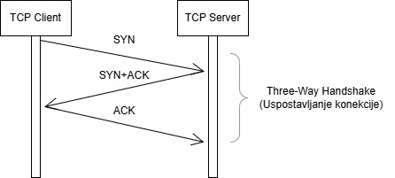
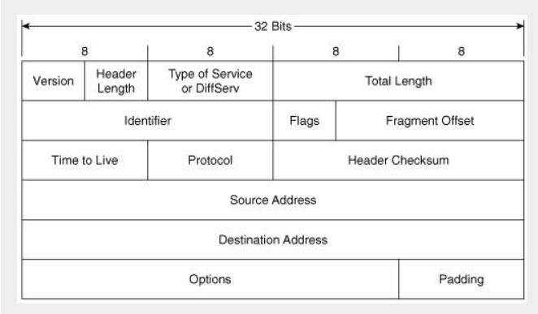
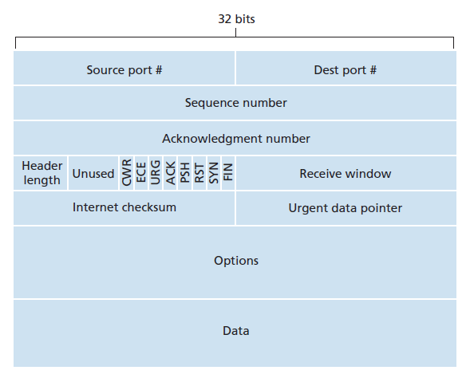
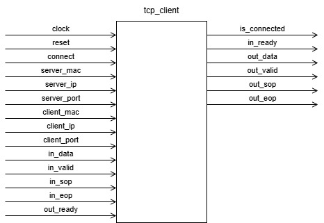
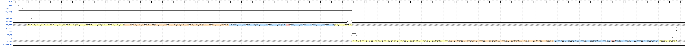

net_# tcp-client-handshake
VHDL modul koji implementira klijentsku stranu uspostavljanja TCP konekcije.  

## Uvod
Transportni sloj pruža logičku komunikaciju između aplikacijskih procesa na različitim hostovima. Logička komunikacija podrazumijeva slanje poruka između hostova kao da su direktno povezani, bez brige o stvarnoj fizičkoj infrastukturi koja leži ispod. Pakete na transportnom sloju nazivamo segmentima. Protokoli na transportnom sloju su implementirani na krajnjim tačakama a ne na mrežnim ruterima. Jedan od tih protokola je TCP (Transmission Control Protocol). 
## TCP protokol i scenariji razmjene poruka
TCP protokol pruža pouzdanu, konekcijski orijentisanu komunikaciju između krajnjih korisnika. TCP koristi kontrolu toka, sekvencijske brojeve, tajmere, potvrde te na taj način osigurava da poruke koje su poslane budu ispravne i tačno po redoslijedu slanja primljene [1].

### Three-way handshake
Uspostava TCP konekcije realizuje se putem three-way handshake mehanizma, koji osigurava da su i klijent i server spremni za pouzdanu komunikaciju. Proces se sastoji od tri koraka: slanja SYN poruke od klijenta ka serveru, zatim odgovora servera sa SYN+ACK porukom, te završne ACK poruke od strane klijenta prikazane pomoću sekvencijalnog dijagrama na Slici 1 [1].

 

Slika 1: TCP three-way handshake (klijentska strana)

U okviru ovog projekta implementirana je klijentska strana TCP three-way handshake procesa, pri čemu se serverska strana posmatra kao eksterni entitet. Prilikom uspostave konekcije prenose se Ethernet okviri u kojima je enkapsuliran IPv4 paket, dok je unutar IPv4 paketa enkapsuliran TCP segment. Na dijagramu su prikazana samo polja Ethernet, IPv4 i TCP zaglavlja koja su relevantna za proces uspostave TCP konekcije, dok se ostala polja ne razmatraju u kontekstu ovog projekta. Sekvencijski i potvrđujući brojevi prikazani na dijagramu služe ilustraciji TCP mehanizma, pri čemu se vrijednosti uvećavaju za 1 zbog prijema SYN segmenta koji zauzima jedan sekvencijski broj.[2] U nastavku dokumenta objašnjen je sadržaj i enkapsulacija prenesenih paketa. 

### Sadržaj i enkapsulacija prenesenih paketa
Prilikom analize razmjene poruka tokom uspostave TCP konekcije, neophodno je posmatrati kompletan Ethernet/IP/TCP paket.

Ethernet zaglavlje sadrži sljedeća polja od interesa: izvorišna i odredišna MAC adresa, kao i polje EtherType koje označava da se u podatkovnom dijelu nalazi IPv4 paket (vrijednost 0x0800).

Slika 2: Struktura Ethernet II okvira

IPv4 zaglavlje sadrži izvorne i odredišne IP adrese, kao i polje Protocol koje ima vrijednost 6 i označava da se u podatkovnom dijelu nalazi TCP segment.

Slika 3: Struktura IPv4 zaglavlja 

TCP segment se sastoji od zaglavlja i podatkovnog dijela. Zaglavlje TCP segmenta sadrži izvorni i odredišni port, sekvencijski broj, potvrđujući broj, veličinu prozora, opcionalna polja, kao i kontrolne flagove koji upravljaju uspostavom i prekidom konekcije. Flagovi SYN i ACK su posebno značajni jer se koriste tokom three-way handshake procesa. U tipičnoj implementaciji TCP protokola, zaglavlje segmenta ima minimalnu dužinu od 20 bajtova, dok se tokom uspostave konekcije ne prenose aplikacioni podaci. [1] 

Slika 4: Struktura TCP segmenta [1]

### Zaglavlja paketa u procesu uspostave TCP konekcije

Tokom uspostave TCP konekcije u okviru three-way handshake procesa prenose se samo kontrolni TCP segmenti. U SYN segmentu aktivan je samo SYN kontrolni flag, dok se potvrđujući broj ne koristi. Server zatim odgovara SYN+ACK segmentom, pri čemu ACK polje sadrži sekvencijski broj klijenta uvećan za jedan. Na kraju, klijent šalje ACK segment sa aktivnim ACK kontrolnim flagom kojim potvrđuje sekvencijski broj servera, čime se konekcija smatra uspješno uspostavljenom.

### Tok uspostave TCP konekcije (klijentska strana)
#### Slučaj 1: Uspješna uspostava konekcije

Slučaj prikazuje standardni three-way handshake proces. Nakon aktivacije signala `connect`, klijent šalje TCP SYN segment prema serveru. Server odgovara SYN+ACK segmentom, nakon čega klijent šalje završni ACK segment. Uspješna uspostava konekcije indicira se postavljanjem signala `is_connected` na logičku vrijednost '1'.

#### Slučaj 2: Izostanak odgovora servera

Nakon slanja TCP SYN segmenta, klijent ne prima odgovarajući SYN+ACK odgovor sa serverske strane. Modul ostaje u stanju čekanja odgovora i ne prelazi u završnu fazu uspostave konekcije, pri čemu signal `is_connected` ostaje na logičkoj vrijednosti '0'. Implementacija ne uključuje mehanizme retransmisije niti vremenskog isteka, te se proces uspostave može prekinuti isključivo resetovanjem ili ponovnim pokretanjem inicijacije konekcije.

#### Slučaj 3: Neočekivan odgovor servera (RST)

U ovom scenariju klijent šalje TCP SYN segment, ali sa serverske strane prima neočekivan odgovor, kao što je TCP segment sa postavljenim RST flag-om ili segment koji ne odgovara očekivanom SYN+ACK odgovoru. Na osnovu primljenog paketa, modul detektuje da uspostava konekcije nije moguća, prekida proces uspostave i vraća se u početno stanje. Signal `is_connected` ostaje na logičkoj vrijednosti '0'.

 

Slika 5: Neočekivan odgovor servera prilikom uspostave TCP konekcije 

U skladu sa TCP specifikacijom, RST segment koji predstavlja odgovor na primljeni SYN segment sadrži i ACK flag, pri čemu potvrđujući broj odgovara sekvencijskom broju primljenog SYN-a uvećanom za jedan. [2]

Navedeni slučajevi predstavljaju osnovu za modeliranje upravljačke logike pomoću FSM dijagrama, kao i za definisanje scenarija, te izradu WaveDrom dijagrama koji grafički prikazuju ponašanje signala kroz vrijeme.

## Opis dizajna modula

Modul `tcp_client` realizuje klijentsku stranu uspostave TCP konekcije. Upravljačka logika je implementirana kao konačni automat (FSM) koji upravlja redoslijedom slanja i prijema TCP segmenata, dok se komunikacija sa okruženjem ostvaruje putem Avalon-ST interfejsa.

Slika 6: Blok dijagram modula tcp_client

## Interfejs i signali
U nastavku su opisani ulazni i izlazni signali modula `tcp_client` koji čine njegov interfejs prema okruženju.

### Ulazni signali

- **clock**  
  Sistemski takt koji sinhronizuje rad modula.

- **reset**  
  Asinhroni ili sinhroni reset signal kojim se modul vraća u početno stanje.

- **connect**  
  Signal kojim se inicira proces uspostave TCP konekcije.

- **server_mac**, **server_ip**, **server_port**  
  Parametri koji definišu MAC adresu, IP adresu i port servera sa kojim se uspostavlja TCP konekcija.

- **client_mac**, **client_ip**, **client_port**  
  Parametri koji definišu MAC adresu, IP adresu i port klijenta.

- **in_data**  
  Ulazni podatkovni signal Avalon-ST interfejsa koji nosi bajtove primljenog TCP segmenta (dolazi sa servera).

- **in_valid**  
  Signal koji označava da su podaci na signalu `in_data` važeći.

- **in_sop**, **in_eop**  
  Signali koji označavaju početak i kraj TCP segmenta.

- **out_ready**  
  Signal kojim strana servera označava spremnost za prihvatanje izlaznih podataka.

### Izlazni signali

- **out_data**  
  Izlazni podatkovni signal Avalon-ST interfejsa koji nosi bajtove TCP segmenta koji se šalje (prema serveru).

- **out_valid**  
  Signal koji označava da su podaci na signalu `out_data` važeći.

- **out_sop**, **out_eop**  
  Signali koji označavaju početak i kraj TCP segmenta na izlazu.

- **in_ready**  
  Signal kojim modul (klijentska strana) označava spremnost za prihvatanje ulaznih podataka.

- **is_connected**  
  Statusni signal koji označava da je TCP konekcija uspješno uspostavljena.

## Ready/Valid rukovanje (Avalon-ST)

Prijenos podataka na Avalon-ST interfejsu realizuje se korištenjem ready/valid rukovanja. Prijenos ili prijem podataka vrši se isključivo u taktovima u kojima su signali `valid` i `ready` istovremeno aktivni, dok se u suprotnom prenos odgađa bez gubitka informacija.

## Simulacija i verifikacija
### Opis testnih scenarija

Verifikacija funkcionalnosti modula `tcp_client` vrši se simulacijom karakterističnih testnih scenarija koji pokrivaju uspostavu TCP konekcije i ponašanje modula u prisustvu ready/valid rukovanja na Avalon-ST interfejsu.

#### Testni scenarij 1: Uspješna uspostava TCP konekcije

Simulira se standardni three-way handshake proces. Nakon aktivacije signala `connect`, modul generiše TCP SYN segment koji se šalje prema serveru. To će značiti da se formira segment sa SYN flag-om postavljenim na 1 te dodatno podešenim ostalim poljima TCP segmenta (kao što su 16-bitni izvorišni i destinacijski port). Taj segment će se slati preko 8-bitnog podatkovnog izlaza (`out_data`). Server odgovara SYN+ACK segmentom (SYN i ACK flag-ovi postavljeni na 1) koji se ispravno prima preko ulaznog Avalon-ST interfejsa (`in_data`, `in_valid`, `in_sop`, `in_eop`). Na osnovu primljenog odgovora, modul šalje završni ACK segment (ACK na 1) i postavlja signal `is_connected` na logičku vrijednost '1', čime se potvrđuje uspješna uspostava TCP konekcije.

Slika 7: Wavedrom za testni scenarij 1

#### Testni scenarij 2: Izostanak očekivanog SYN+ACK odgovora

U ovom scenariju modul šalje TCP SYN segment, ali ne prima odgovarajući SYN+ACK odgovor sa serverske strane. Modul ostaje u stanju čekanja odgovora i ne šalje završni ACK segment. Ukoliko istekne vrijeme čekanja odgovora, izvršava se retransmisija, odnosno ponovno slanje TCP SYN segmenta. Nakon što istekne retransmisijksi timeout, prekida se zahtjev za uspostavom konekcije i signal `is_connected` ostaje na logičkoj vrijednosti '0'. Time se potvrđuje da konekcija nije uspostavljena.

Slika 8: Wavedrom za testni scenarij 2

#### Testni scenarij 3: Neočekivani odgovor servera (RST)

Simulira se scenario u kojem server odgovara TCP segmentom sa postavljenim RST flag-om. Nakon prijema RST(+ACK) segmenta modul detektuje neočekivan odgovor i prekida uspostavu konekcije, prestaje sa slanjem daljih segmenata (`out_valid` ostaje 0) i čeka novi connect za ponovni pokušaj, pri čemu `is_connected` ostaje 0.

Slika 9: Wavedrom za testni scenarij 3

## Modeliranje upravljačke logike
### FSM dijagram
### Opis FSM stanja
## Implementacija

## Zaključak

## Literatura
[1] Kurose, James F., and Keith W. Ross. "Computer networking: A top-down approach edition." Addision Wesley 12 (2007).

[2] Eddy, W., "Transmission Control Protocol (TCP)", RFC 9293, August 2022.

